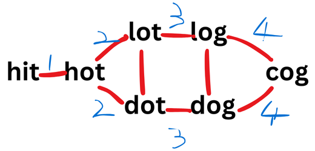

# LeetCode 127. Word Ladder's Solution
LeetCode link: [127. Word Ladder](https://leetcode.com/problems/word-ladder/)

## LeetCode problem description
A **transformation sequence** from word `beginWord` to word `endWord` using a dictionary `wordList` is a sequence of words `beginWord -> s1 -> s2 -> ... -> sk` such that:

* Every adjacent pair of words differs by a single letter.
* Every `si` for `1 <= i <= k` is in `wordList`. Note that `beginWord` does not need to be in `wordList`.
* `sk == endWord`

Given two words, `beginWord` and `endWord`, and a dictionary `wordList`, return **the number of words** in the **shortest transformation sequence** from `beginWord` to `endWord`, or `0` if no such sequence exists.

### Example 1
```
Input: beginWord = "hit", endWord = "cog", wordList = ["hot","dot","dog","lot","log","cog"]
Output: 5
Explanation: One shortest transformation sequence is "hit" -> "hot" -> "dot" -> "dog" -> cog", which is 5 words long.
```

### Example 2
```
Input: beginWord = "hit", endWord = "cog", wordList = ["hot","dot","dog","lot","log"]
Output: 0
Explanation: The endWord "cog" is not in wordList, therefore there is no valid transformation sequence.
```

### Constraints
- `1 <= beginWord.length <= 10`
- `endWord.length == beginWord.length`
- `1 <= wordList.length <= 5000`
- `wordList[i].length == beginWord.length`
- `beginWord`, `endWord`, and `wordList[i]` consist of lowercase English letters.
- `beginWord != endWord`
- All the words in `wordList` are **unique**.

## Intuition
This problem is hard. Before solving this problem, you can do the following problem first:

- [200. Number of Islands (Solution 3: Breadth-First Search)](200-number-of-islands-3.md)

The **word transformation sequence** problem can be abstracted into a **graph theory** problem. And it is an **undirected graph**:



### Breadth-First Search


* As shown in the figure above, **Breadth-First Search** can be thought of as visiting vertices in rounds and rounds. Actually, whenever you see a question is about
  getting `minimum number` of something of a graph, `Breadth-First Search` would probably help.

* `Breadth-First Search` emphasizes first-in-first-out, so a **queue** is needed.

## Approach
1. `Breadth-First Search` a graph means traversing **from near to far**, from `circle 1` to `circle N`. Each `circle` is a round of iteration.
1. So through `Breadth-First Search`, when a word matches `endWord`, the game is over, and we can return the number of **circle** as a result.

## Complexity
* Time: `O((26 * end_word.length) * N)`.
* Space: `O(N)`.

## Python
```python
from collections import deque

class Solution:
    def ladderLength(self, begin_word: str, end_word: str, word_list: List[str]) -> int:
        words = set(word_list)

        if end_word not in words:
            return 0

        if begin_word == end_word:
            return 1

        queue = deque([begin_word])

        if begin_word in words:
            words.remove(begin_word)

        result = 0

        while queue:
            size = len(queue)
            result += 1

            for i in range(size):
                current_word = queue.popleft()

                for word in one_letter_changed_words(current_word):
                    if word == end_word:
                        return result + 1

                    if word in words:
                        queue.append(word)
                        words.remove(word)
        
        return 0


def one_letter_changed_words(word):
    words = []

    for i in range(len(word)):
        for letter in 'abcdefghijklmnopqrstuvwxyz':
            if letter != word[i]:
                words.append(word[:i] + letter + word[i + 1:])

    return words
```

## Java
```java
// Welcome to create a PR to complete the code of this language, thanks!
```

## C++
```cpp
// Welcome to create a PR to complete the code of this language, thanks!
```

## JavaScript
```javascript
// Welcome to create a PR to complete the code of this language, thanks!
```

## C#
```c#
// Welcome to create a PR to complete the code of this language, thanks!
```

## Go
```go
// Welcome to create a PR to complete the code of this language, thanks!
```

## Ruby
```ruby
# Welcome to create a PR to complete the code of this language, thanks!
```

## C
```c
// Welcome to create a PR to complete the code of this language, thanks!
```

## Kotlin
```kotlin
// Welcome to create a PR to complete the code of this language, thanks!
```

## Swift
```swift
// Welcome to create a PR to complete the code of this language, thanks!
```

## Rust
```rust
// Welcome to create a PR to complete the code of this language, thanks!
```

## Other languages
```
// Welcome to create a PR to complete the code of this language, thanks!
```
