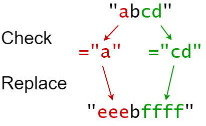
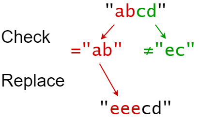

# 833. Find And Replace in String - LeetCode Best Practices

Visit original link: [833. Find And Replace in String - LeetCode Best Practices](https://leetcoder.net/en/leetcode/833-find-and-replace-in-string) for a better experience!

LeetCode link: [833. Find And Replace in String](https://leetcode.com/problems/find-and-replace-in-string), difficulty: **Medium**.

## LeetCode description of "833. Find And Replace in String"

You are given a **0-indexed** string `s` that you must perform `k` replacement operations on. The replacement operations are given as three **0-indexed** parallel arrays, `indices`, `sources`, and `targets`, all of length `k`.

To complete the *i<sup>th</sup>* replacement operation:

1. Check if the **substring** `sources[i]` occurs at index `indices[i]` in the **original string** `s`.
2. If it does not occur, **do nothing**.
3. Otherwise if it does occur, **replace** that substring with `targets[i]`.

For example, if `s = "abcd"`, `indices[i] = 0`, `sources[i] = "ab"`, and `targets[i] = "eee"`, then the result of this replacement will be `"eeecd"`.


All replacement operations must occur **simultaneously**, meaning the replacement operations should not affect the indexing of each other. The testcases will be generated such that the replacements will **not overlap**.

- For example, a testcase with `s = "abc"`, `indices = [0, 1]`, and `sources = ["ab","bc"]` will not be generated because the `"ab"` and `"bc"` replacements overlap.
Return the ***resulting string*** after performing all replacement operations on `s`.

A **substring** is a contiguous sequence of characters in a string.

### [Example 1]



**Input**: `s = "abcd", indices = [0,2], sources = ["a","cd"], targets = ["eee","ffff"]`

**Output**: `"eeebffff"`

**Explanation**: 

<p>&quot;a&quot; occurs at index 0 in s, so we replace it with &quot;eee&quot;.<br>
&quot;cd&quot; occurs at index 2 in s, so we replace it with &quot;ffff&quot;.</p>


### [Example 2]



**Input**: `s = "abcd", indices = [0, 2], sources = ["ab","ec"], targets = ["eee","ffff"]`

**Output**: `"eeecd"`

**Explanation**: 

<p>&quot;ab&quot; occurs at index 0 in s, so we replace it with &quot;eee&quot;.<br>
&quot;ec&quot; does not occur at index 2 in s, so we do nothing.</p>


### [Constraints]

- `1 <= s.length <= 1000`
- `k == indices.length == sources.length == targets.length`
- `1 <= k <= 100`
- `0 <= indexes[i] < s.length`
- `1 <= sources[i].length, targets[i].length <= 50`
- `s` consists of only lowercase English letters.
- `sources[i]` and `targets[i]` consist of only lowercase English letters.

## Intuition

This question looks simple, but it takes a lot of time to do it.

- Question 1: For the target string `result`, you can clone it based on the original string or build it from an empty string. Which one is better?
    <details><summary>Click to view the answer</summary><p> Cloning based on the original string is better. Because you save a lot of substring assignment operations.</p></details>

- Question 2: After replacing the substring of `result` with `targets[i]`, the length of `result` may change, which makes subsequent replacement difficult. How to solve it?
    <details><summary>Click to view the answer</summary><p> Use technical means to keep the length of `result` unchanged after string replacement.</p></details>

## Complexity

> N = s.length

- Time complexity: `O(N)`.
- Space complexity: `O(N)`.

## Python

```python
class Solution:
    def findReplaceString(self, s: str, indices: List[int], sources: List[str], targets: List[str]) -> str:
        result = list(s)

        for i in range(len(indices)):
            index = indices[i]

            if s[index:index + len(sources[i])] == sources[i]:
                for j in range(index, index + len(sources[i])):
                    if j == index:
                        result[j] = targets[i]
                    else:
                        result[j] = ''

        return ''.join(result)
```

## Other languages

```java
// Welcome to create a PR to complete the code of this language, thanks!
```

Dear LeetCoders! For a better LeetCode problem-solving experience, please visit website [leetcoder.net](https://leetcoder.net): Dare to claim the best practices of LeetCode solutions! Will save you a lot of time!

Original link: [833. Find And Replace in String - LeetCode Best Practices](https://leetcoder.net/en/leetcode/833-find-and-replace-in-string).

GitHub repository: [f*ck-leetcode](https://github.com/fuck-leetcode/fuck-leetcode).

