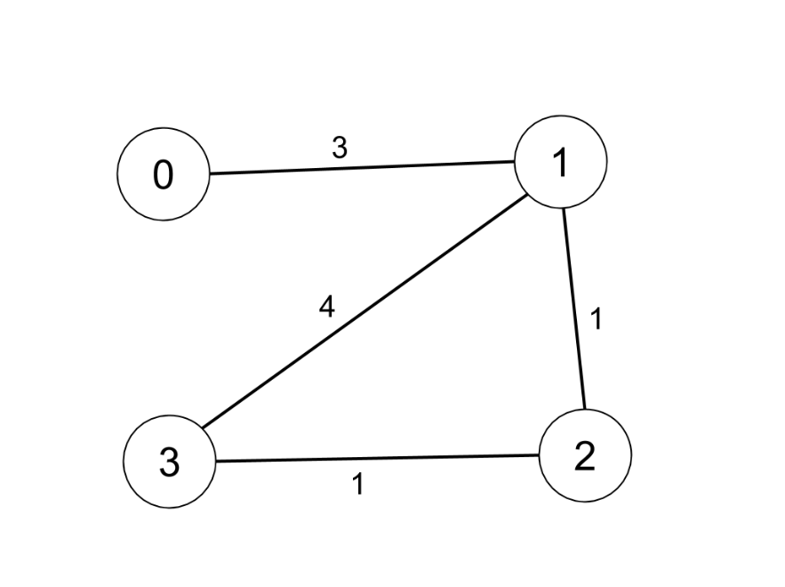

# 1334. Find the City With the Smallest Number of Neighbors at a Threshold Distance - Best Practices of LeetCode Solutions
LeetCode link: [1334. Find the City With the Smallest Number of Neighbors at a Threshold Distance](https://leetcode.com/problems/find-the-city-with-the-smallest-number-of-neighbors-at-a-threshold-distance), difficulty: **Medium**.

## LeetCode description of "1334. Find the City With the Smallest Number of Neighbors at a Threshold Distance"
There are `n` cities numbered from `0` to `n-1`. Given the array edges where `edges[i] = [from_i, to_i, weight_i]` represents a bidirectional and weighted edge between cities `from_i` and `to_i`, and given the integer `distanceThreshold`.

Return the city with the smallest number of cities that are reachable through some path and whose distance is **at most** `distanceThreshold`, If there are multiple such cities, return the city with the greatest number.

Notice that the distance of a path connecting cities _**i**_ and _**j**_ is equal to the sum of the edges' weights along that path.

### [Example 1]


**Input**: `n = 4, edges = [[0,1,3],[1,2,1],[1,3,4],[2,3,1]], distanceThreshold = 4`

**Output**: `3`

**Explanation**:
```
The figure above describes the graph. 
The neighboring cities at a distanceThreshold = 4 for each city are:
City 0 -> [City 1, City 2] 
City 1 -> [City 0, City 2, City 3] 
City 2 -> [City 0, City 1, City 3] 
City 3 -> [City 1, City 2] 
Cities 0 and 3 have 2 neighboring cities at a distanceThreshold = 4, but we have to return city 3 since it has the greatest number.
```

### [Example 2]


**Input**: `n = 5, edges = [[0,1,2],[0,4,8],[1,2,3],[1,4,2],[2,3,1],[3,4,1]], distanceThreshold = 2`

**Output**: `0`

**Explanation**:
```
The figure above describes the graph. 
The neighboring cities at a distanceThreshold = 2 for each city are:
City 0 -> [City 1] 
City 1 -> [City 0, City 4] 
City 2 -> [City 3, City 4] 
City 3 -> [City 2, City 4]
City 4 -> [City 1, City 2, City 3] 
The city 0 has 1 neighboring city at a distanceThreshold = 2.
```

### [Constraints]
- `2 <= n <= 100`
- `1 <= edges.length <= n * (n - 1) / 2`
- `edges[i].length == 3`
- `0 <= from_i < to_i < n`
- `1 <= weight_i, distanceThreshold <= 10^4`
- All pairs `(from_i, to_i)` are distinct.

### [Hints]
<details>
  <summary>Hint 1</summary>
  Use Floyd-Warshall's algorithm to compute any-point to any-point distances. (Or can also do Dijkstra from every node due to the weights are non-negative).
</details>

<details>
  <summary>Hint 2</summary>
  For each city calculate the number of reachable cities within the threshold, then search for the optimal city.
</details>

## Intuition
Just like the `Hints` says, you can use **Floyd-Warshall algorithm** to compute any-point to any-point shortest distances.

Or you can also do **Dijkstra algorithm** from every node due to the weights are non-negative.

## Complexity
* Time: `O(N^3)`.
* Space: `O(N^2)`.

## Python
```python
class Solution:
    def findTheCity(self, n: int, edges: List[List[int]], distance_threshold: int) -> int:
        dp = []

        for i in range(n):
            dp.append([float('inf')] * n)
            dp[i][i] = 0

        for i, j, weight in edges:
            dp[i][j] = weight
            dp[j][i] = weight

        for k in range(n):
            for i in range(n):
                for j in range(n):
                    dp[i][j] = min(
                        dp[i][j],
                        dp[i][k] + dp[k][j],
                    )

        result = -1
        min_count = float('inf')

        for i, row in enumerate(dp):
            count = len([distance for distance in row if distance <= distance_threshold])

            if count <= min_count:
                min_count = count
                result = i

        return result
```

## JavaScript
```javascript
// Welcome to create a PR to complete the code of this language, thanks!
```

## Java
```java
// Welcome to create a PR to complete the code of this language, thanks!
```

## C++
```cpp
// Welcome to create a PR to complete the code of this language, thanks!
```

## C#
```c#
// Welcome to create a PR to complete the code of this language, thanks!
```

## Go
```go
// Welcome to create a PR to complete the code of this language, thanks!
```

## Ruby
```ruby
# Welcome to create a PR to complete the code of this language, thanks!
```

## C, Kotlin, Swift, Rust or other languages
```
// Welcome to create a PR to complete the code of this language, thanks!
```
