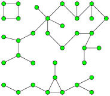

# LeetCode 827. Making A Large Island's Solution
LeetCode link: [827. Making A Large Island](https://leetcode.com/problems/making-a-large-island/)

## LeetCode problem description
You are given an `n x n` binary matrix `grid`. You are allowed to change at most one `0` to be `1`.

Return the size of the largest island in `grid` after applying this operation.

An island is a 4-directionally connected group of `1`s.

### Example 1
```
Input: grid = [
    [1,0],
    [0,1]
]
Output: 3
Explanation: Change one 0 to 1 and connect two 1s, then we get an island with area = 3.
```

### Example 2
```
Input: grid = [
    [1,1],
    [1,0]
]
Output: 4
Explanation: Change the 0 to 1 and make the island bigger, only one island with area = 4.
```
### Example 3
```
Input: grid = [
    [1,1],
    [1,1]
]
Output: 4
Explanation: Can't change any 0 to 1, only one island with area = 4.
```

### Constraints
- `n == grid.length`
- `n == grid[i].length`
- `1 <= n <= 500`
- `grid[i][j]` is either `0` or `1`.

## Intuition
This problem is hard. Before solving this problem, you can do the following two problems first:

- [200. Number of Islands](200-number-of-islands.md)
- [695. Max Area of Island](695-max-area-of-island.md)

The island problem can be abstracted into a **graph theory** problem. This is an **undirected graph**:


And this graph may have multiple **connected components** (islands):



## Approach
1. Change one vertex from `0` to `1` to make the largest island means combining the adjacent islands of a `0` vertex.
1. We can mark an island's lands with one same id (`island_id`), and mark another island's lands with another `island_id`. To mark a land, just change its value to the `island_id`.
1. Use a `map` (or an `array`) to map each `island_id` to its area (`land_count`).
1. How to calculate the area of an island? Using `Depth-First Search` or `Breadth-First Search`. See [695. Max Area of Island](695-max-area-of-island.md).
1. Iterate through each `0` (water), then sum the areas (`land_count`) of neighboring islands.
1. Record the max area and return it.

## Complexity
* Time: `O(n * n)`.
* Space: `O(n * n)`.

## Python
```python
class Solution:
    def __init__(self):
        self.result = 0
        self.grid = None
        self.land_count = 0
        self.land_counts = [0, 0] # Since `island_id` starts from 2, the first two records will not be used
        self.island_id = 2

    def largestIsland(self, grid: List[List[int]]) -> int:
        self.grid = grid

        for i, row in enumerate(self.grid):
            for j, value in enumerate(row):
                if value == 1:
                    self.land_count = 0

                    self.depth_first_search(i, j)

                    self.land_counts.append(self.land_count)
                    
                    self.result = max(self.land_count, self.result)

                    self.island_id += 1
        
        for i, row in enumerate(grid):
            for j, value in enumerate(row):
                if value == 0:
                    self.result = max(
                        self.combined_islands_land_count(i, j),
                        self.result
                    )

        return self.result
    
    def depth_first_search(self, i, j):
        if i < 0 or i >= len(self.grid):
            return
        
        if j < 0 or j >= len(self.grid[0]):
            return
        
        if self.grid[i][j] != 1:
            return
        
        self.grid[i][j] = self.island_id

        self.land_count += 1

        self.depth_first_search(i - 1, j)
        self.depth_first_search(i, j + 1)
        self.depth_first_search(i + 1, j)
        self.depth_first_search(i, j - 1)
    
    def combined_islands_land_count(self, i, j):
        used_island_ids = set()
        count = 1

        count += self.island_land_count(i - 1, j, used_island_ids)
        count += self.island_land_count(i, j + 1, used_island_ids)
        count += self.island_land_count(i + 1, j, used_island_ids)
        count += self.island_land_count(i, j - 1, used_island_ids)

        return count
    
    def island_land_count(self, i, j, used_island_ids):
        if i < 0 or i >= len(self.grid):
            return 0
        
        if j < 0 or j >= len(self.grid[0]):
            return 0
        
        if self.grid[i][j] == 0:
            return 0

        island_id = self.grid[i][j]

        if island_id in used_island_ids:
            return 0
        
        used_island_ids.add(island_id)
        
        return self.land_counts[island_id]
```

## Java
```java
// Welcome to create a PR to complete the code of this language, thanks!
```

## C++
```cpp
// Welcome to create a PR to complete the code of this language, thanks!
```

## JavaScript
```javascript
// Welcome to create a PR to complete the code of this language, thanks!
```

## C#
```c#
// Welcome to create a PR to complete the code of this language, thanks!
```

## Go
```go
// Welcome to create a PR to complete the code of this language, thanks!
```

## Ruby
```ruby
# Welcome to create a PR to complete the code of this language, thanks!
```

## C
```c
// Welcome to create a PR to complete the code of this language, thanks!
```

## Kotlin
```kotlin
// Welcome to create a PR to complete the code of this language, thanks!
```

## Swift
```swift
// Welcome to create a PR to complete the code of this language, thanks!
```

## Rust
```rust
// Welcome to create a PR to complete the code of this language, thanks!
```

## Other languages
```
// Welcome to create a PR to complete the code of this language, thanks!
```
